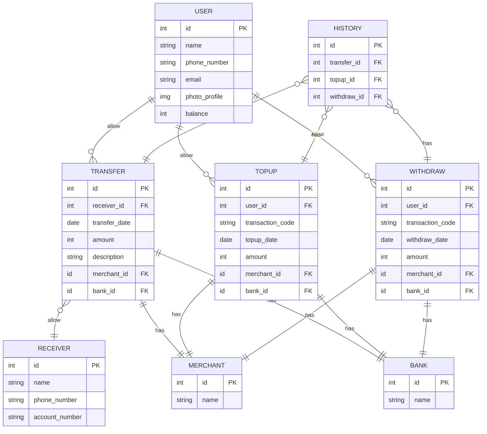

# ERD Ewallet

```mermaid

erDiagram

USER ||--o{ TRANSFER : allow
USER ||--o{ TOPUP : allow
USER ||--o{ WITHDRAW : allow
USER {
  int id PK
  string name
  string phone_number
  string email
  img photo_profile
  int balance
}

RECEIVER {
  int id PK
  string name
  string phone_number
  string account_number
}

TRANSFER }o--|| RECEIVER : allow
TRANSFER ||--|| MERCHANT : has
TRANSFER ||--|| BANK : has
TRANSFER {
  int id PK
  int receiver_id FK
  date transfer_date
  int amount
  string description
  id merchant_id FK
  id bank_id FK
}

TOPUP ||--|| MERCHANT : has
TOPUP ||--|| BANK : has
TOPUP {
  int id PK
  int user_id FK
  string transaction_code
  date topup_date
  int amount
  id merchant_id FK
  id bank_id FK
}

WITHDRAW ||--|| MERCHANT : has
WITHDRAW ||--|| BANK : has
WITHDRAW {
  int id PK
  int user_id FK
  string transaction_code
  date withdraw_date
  int amount
  id merchant_id FK
  id bank_id FK
}

HISTORY }o--|| TRANSFER : has
HISTORY }o--|| TOPUP : has
HISTORY }o--|| WITHDRAW : has
HISTORY {
  int id PK
  int transfer_id FK
  int topup_id FK
  int withdraw_id FK
}

BANK {
  int id PK
  string name
}

MERCHANT {
  int id PK
  string name
}


```
